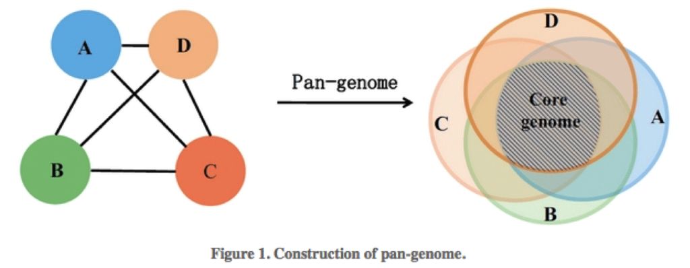

## Pangenome analysis

The microbial **pangenome** is the union of genes shared by genomes of interest. The **core genome** is the intersection of genes of these genomes, thus **core genes** are genes present in all strains. The **accessory genome** (also: variable, flexible, dispensable genome) refers to genes not present in all strains of a species. These include genes present in two or more strains or even genes unique to a single strain. Acquired antibiotic resistance genes are typically genes of the accessory genome.

{alt='Pangenome'}

Find more information of the pangenome [here](https://www.metagenomics.wiki/pdf/definition/pangenome)

### Extract proteins RecB, RubA and DnaA from two genomes.

For this, we need to find if the genes are present in the annotated files.

:::::::::::::::::::::::::::::::::::::::  challenge

## Challenge: How can I extract genes from the file with the genes?

Hints:

```
grep -A 10 [gene] *faa 
gives you the first ten line after the gene name was found
```

:::::::::::::::  solution

## Solution

```output
$ cd annnotation
$ grep -A 10 'recB' */*faa 

```

:::::::::::::::::::::::::

::::::::::::::::::::::::::::::::::::::::::::::::::

Note for each genome if the gene has been found or not. Mark them as present (1) in this [file](https://docs.google.com/spreadsheets/d/1xjiliy_USyMwiyzEgWhpn8_109F7Z3jPM_f7Jp-lOb8/edit?usp=sharing), else mark the gene that differs or is absent as 0.

## Pangenome analysis

Comparing every gene of every genome to every other gene in the dataset is an enourmous task, and takes a long time even if automated. [Roary](https://sanger-pathogens.github.io/Roary/) is a pipeline to determine genes of the core and pangenome. It takes a few short-cuts such as clustering instead of pair-wise alignment and can perform this task in a relatively short time frame. An excellent step-by-step tutorial can be found [here](https://github.com/microgenomics/tutorials/blob/master/pangenome.md)

First we need to put the gff files generated by prokka into a separate folder

```source
$ cd 
$ mkdir ~/dc_workshop/results/annotation/gff_files
$ mv ~/dc_workshop/results/annotation/*/*gff ~/dc_workshop/results/annotation/gff_files
```

You can start a session and give it a descriptive name:

```bash
$ screen -S pangenome
```

This creates a session with the name \<U+2018>pangenome\<U+2019>

As you work, this session will stay active until you close it. Even if you log out or work on something else, the jobs you start in this session will run until completion.

then we can go to the gff directory and start roary

```bash
$ cd ~/dc_workshop/results/annotation/gff_files
$ roary *.gff -r -f ~/dc_workshop/results/pangenome/
```

You can detach from a session by pressing `control + a` followed by `d` (for detach) on your keyboard.

You can now safely work on something else. The process will keep on running.
If you want to check on it, you can restore the session with

```bash
screen -r pangenome
```

::::::::::::::::::::::::::::::::::::::  discussion

## Discussion: Open or closed pangenome?

After roary finished, have a look at the summary file. How many core and pangenome genes are there? Visit the
definition of an open and closed pangenome [here](https://www.metagenomics.wiki/pdf/definition/pangenome) and download and view the file "Rplots.pdf".
Has *M. tuberculosis* a closed or an open pangenome?


::::::::::::::::::::::::::::::::::::::::::::::::::

## Visualization

Some genes are present in all genomes, some are present in some and absent in others. Data on presence and absence of genes was collected in a matrix called gene\_presence\_absence.csv. Clustering of this information was used to build a tree (available as accessory\_binary\_genes.fa.newick). As a next step we are going to visualize this clustering.

:::::::::::::::::::::::::::::::::::::::  challenge

## Challenge: Which isolates are related based on gene presence/absence??

Copy accessory\_binary\_genes.fa.newick and gene\_presence\_absence.csv to your own computer.
Open [phandango](https://jameshadfield.github.io/phandango/) in Chrome, drop file accessory\_binary\_genes.fa.newick and
then file gene\_absence\_presence.csv. Make three groups out of the 7 isolates.

```
filezilla or scp
```

can be used to copy the files from the machine to your own computer

:::::::::::::::  solution

## Solution

```output
3 groups:
..
..
..
```

:::::::::::::::::::::::::

::::::::::::::::::::::::::::::::::::::::::::::::::


